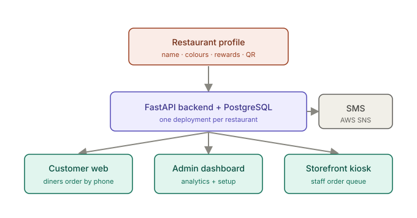
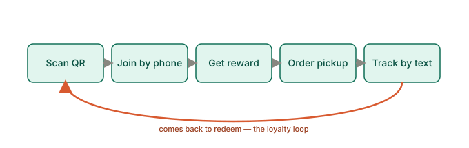
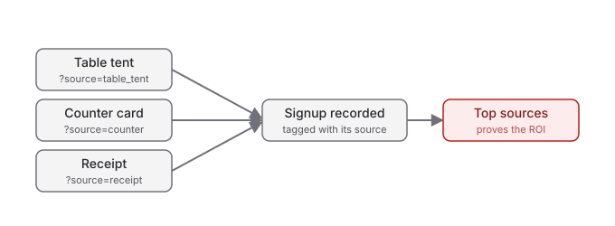

# HongShing — How it works

A one-page overview of the platform: what it is, the loop it creates for a
restaurant, and why the QR attribution matters. For the screenshot-by-screenshot
tours, see the three walkthroughs linked at the bottom.

## One platform, three surfaces

Everything runs from a **single restaurant profile** — name, colours, rewards, QR
sources, menu — that configures one backend and three connected surfaces. The same
product stands up for any restaurant just by swapping the profile (see
[`TEMPLATE-VALIDATION.md`](../../TEMPLATE-VALIDATION.md)).

| Surface | Who uses it | What it does |
|---|---|---|
| **Customer web** | Diners (on their phone) | Scan a QR → join rewards in seconds → browse the menu → order pickup → track it |
| **Admin dashboard** | Owner / manager | Acquisition + rewards analytics, QR campaigns, rewards, devices, settings |
| **Storefront kiosk** | Front-of-house staff | A live order queue — accept, prepare, mark ready |

## The customer loyalty loop

The whole point is a repeatable loop: a QR code turns a walk-in into a rewards
member in about ten seconds — no app, no email, no password — and the reward gives
them a reason to come back. Ordering for pickup lives inside the same page the QR
opened, so the restaurant keeps the customer relationship (and the margin) instead
of handing it to a third-party delivery app.

## Attribution comes for free

Every QR placement carries its own hidden source code. When a diner signs up, that
source is recorded, so the admin dashboard shows **which placement drives the most
signups** — the table tent, the counter card, or the receipt. This is the number
that proves ROI on the program, and it requires no extra work from staff.

## The pitch in one line

> Put a QR code on every table and receipt. Diners join your rewards program in ten
> seconds with just their phone number, order pickup without an app, and come back
> for the reward — and you see exactly which table tent or receipt drove each signup.

## The walkthroughs

1. **[Customer journey](01-customer-journey.md)** — the QR-to-reward-to-reorder loop a diner experiences.
2. **[Admin operations](02-admin-operations.md)** — what the owner sees and controls.
3. **[Storefront kiosk](03-storefront-kiosk.md)** — how staff run the order queue.

> Screenshots are captured from a live local build with demo data (phone
> verification in dev mode, so no real SMS is sent). Branding, colours, rewards and
> QR sources all come from the restaurant profile; a different restaurant shows its
> own. URLs that read `localhost` are the demo environment — a live deployment
> serves the restaurant's own domain.
