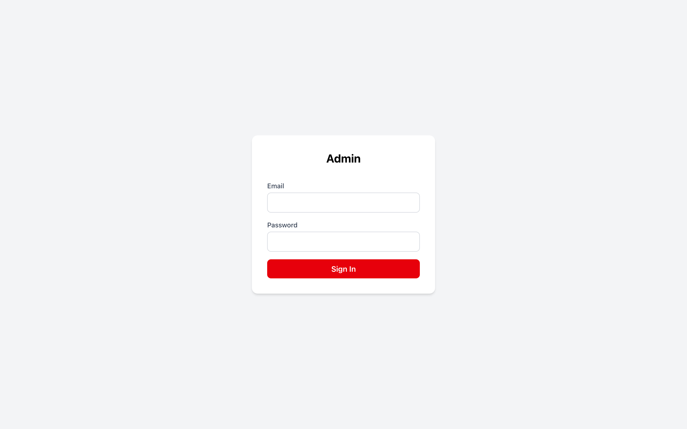
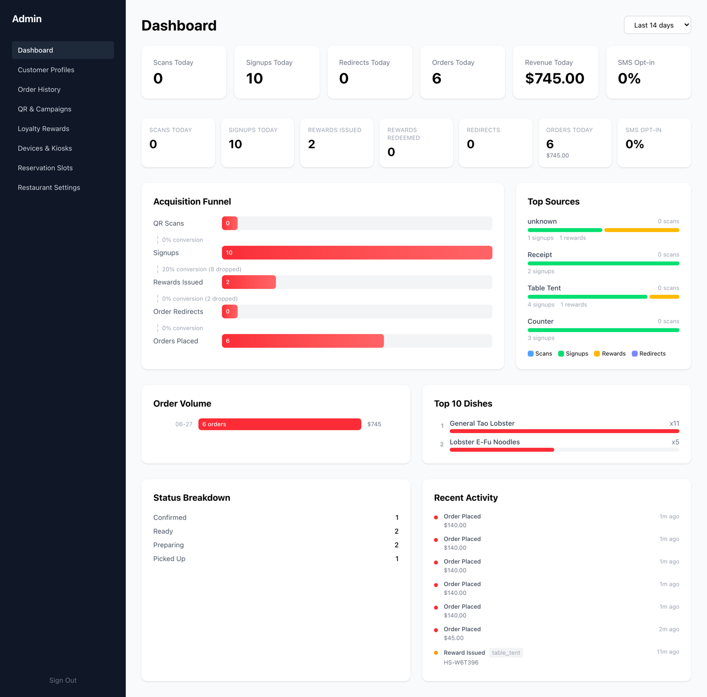
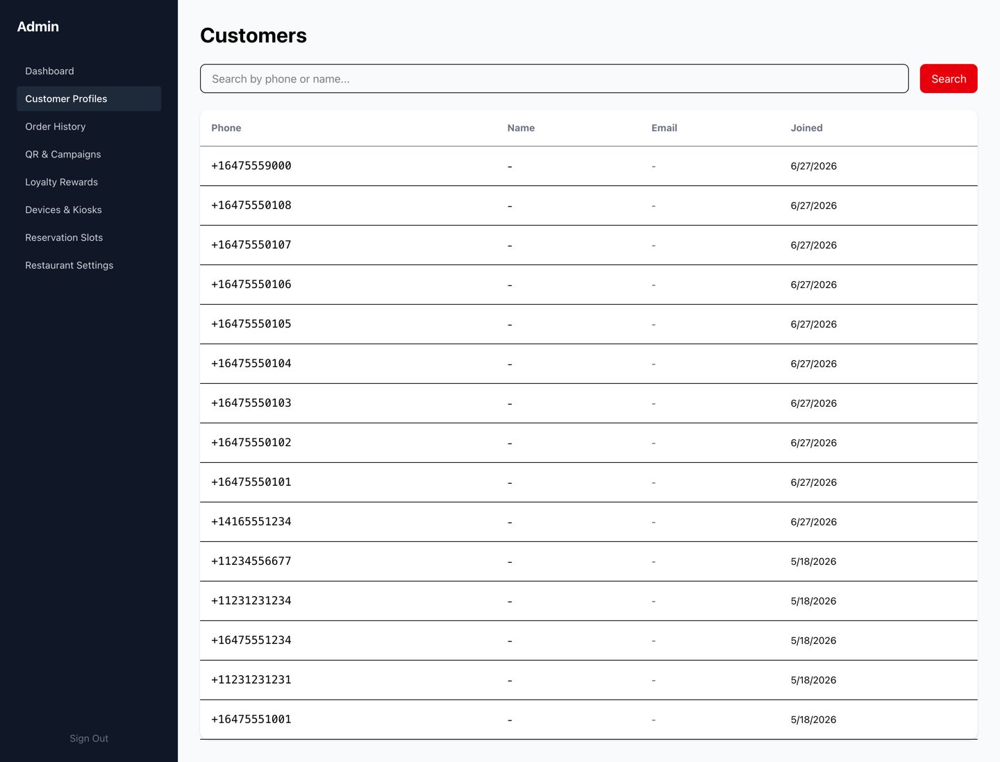
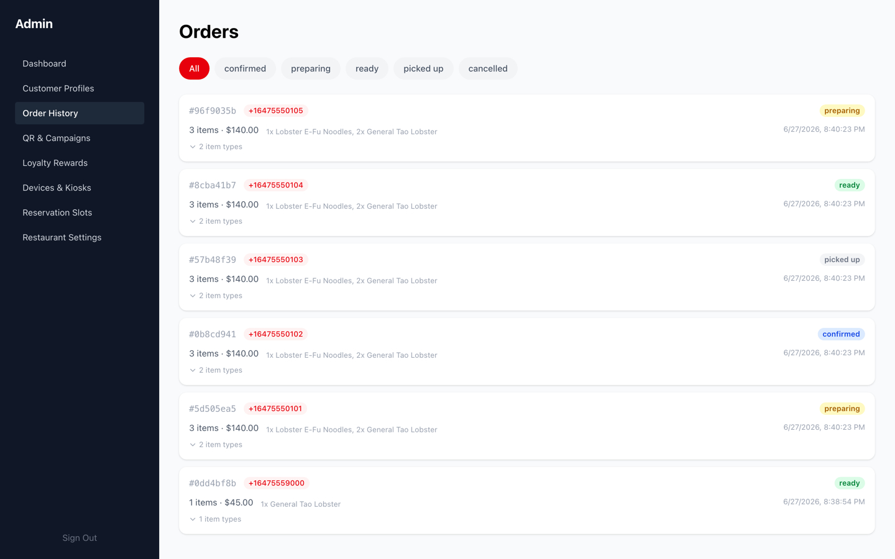
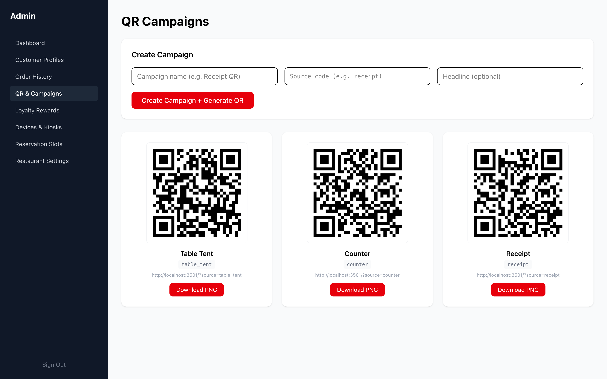
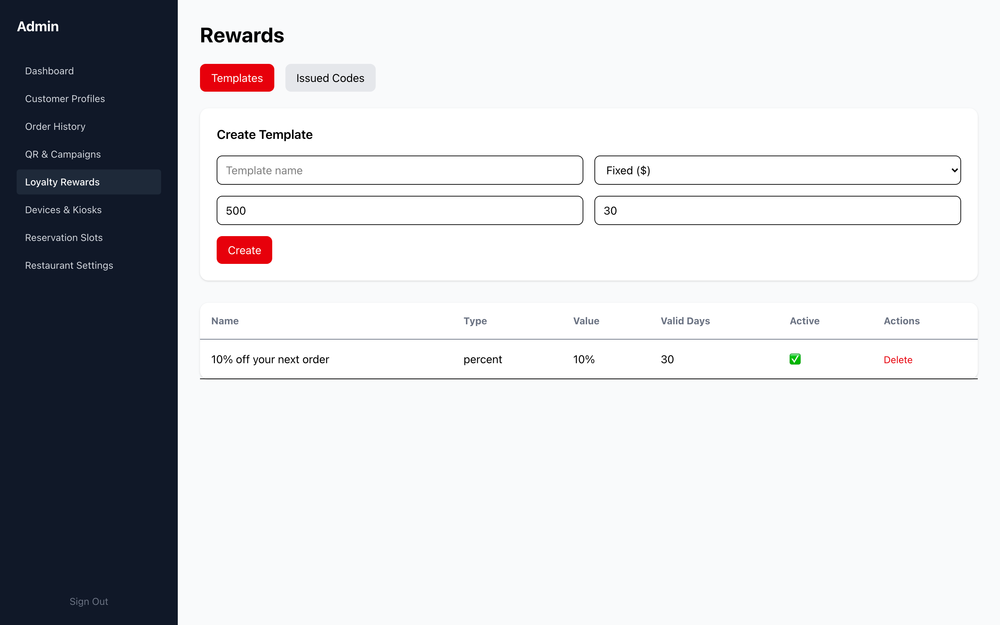
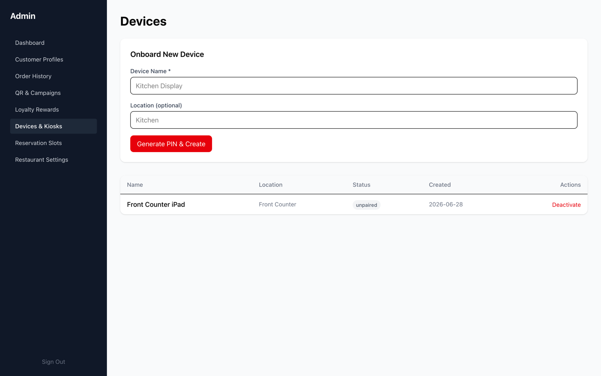
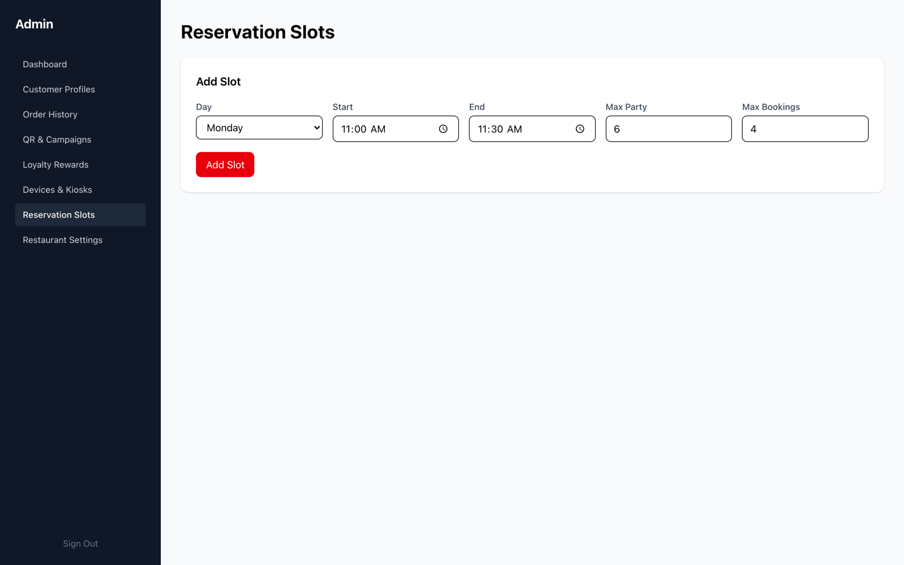
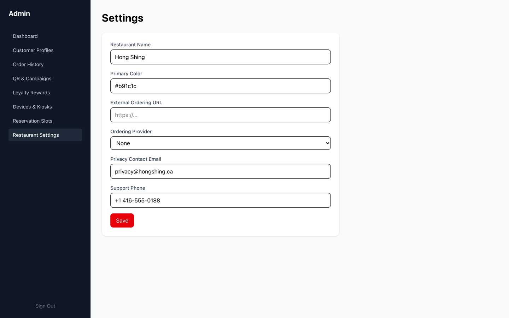

# Admin Operations

What the owner or manager sees and controls. The admin dashboard turns the QR +
rewards activity into numbers, and gives one place to manage campaigns, rewards,
devices, and settings.

---

## Secure sign-in

The admin is a separate, password-protected app. First login forces a password
change, and sessions are cookie-based and locked to the restaurant.

---

## Dashboard — the acquisition + rewards story in numbers

The home screen answers "is this working?" at a glance: scans, signups, rewards
issued, orders, and revenue, plus an **acquisition funnel** (scans → signups →
rewards → orders) and a **top-sources** breakdown.

> **Highlight — source attribution:** "Top Sources" shows which QR placement
> (table tent, counter, receipt) drove each signup and reward. This is the number
> that proves ROI on the program, and it comes for free from the QR source codes.

---

## Customer profiles

Every diner who signs up, searchable by phone, with their signup source and
rewards. This is the marketing list the restaurant now owns.

---

## Order history

Every pickup order with its status and totals — the operational record and the
revenue view.

---

## QR & Campaigns — generate the codes that drive it all

Create a campaign for any source (table tent, counter, receipt, a one-off promo)
and the platform generates a ready-to-print QR code, downloadable as a PNG.

> **Highlight:** each QR encodes its own source code, which is what powers the
> attribution on the dashboard. Print, place, and every scan is tracked.

---

## Loyalty rewards

Define the reward offers — name, type (percent / fixed / freebie), value, and how
long they're valid — and attach them to campaigns.

---

## Devices & kiosks

Pair a front-of-house tablet by generating a one-time PIN. The tablet then runs the
storefront order queue (see [the storefront walkthrough](03-storefront-kiosk.md)).

---

## Reservation slots

Configure bookable time slots for the (optional) reservations feature.

---

## Restaurant settings

Name, branding, ordering link, contact details — the per-restaurant configuration,
editable from the admin.

