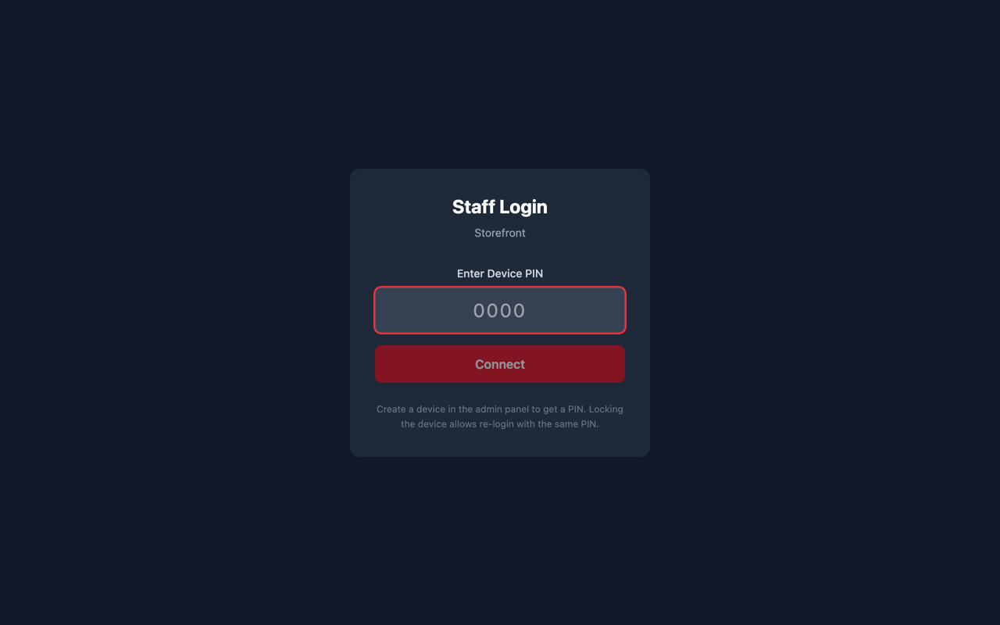
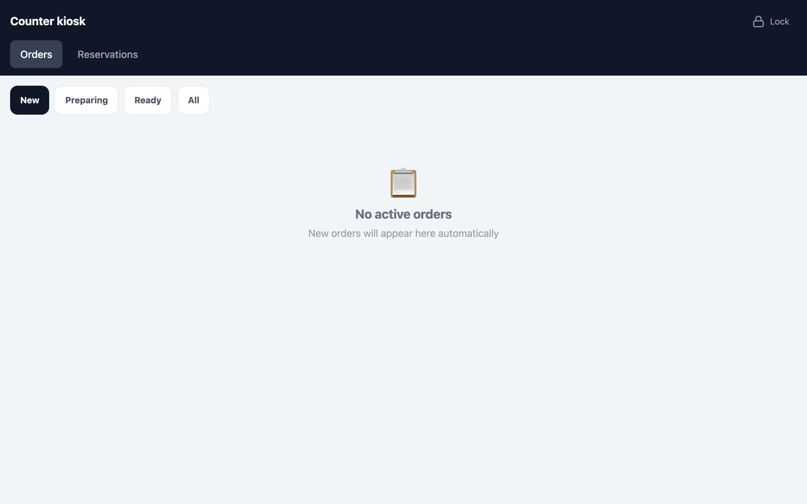
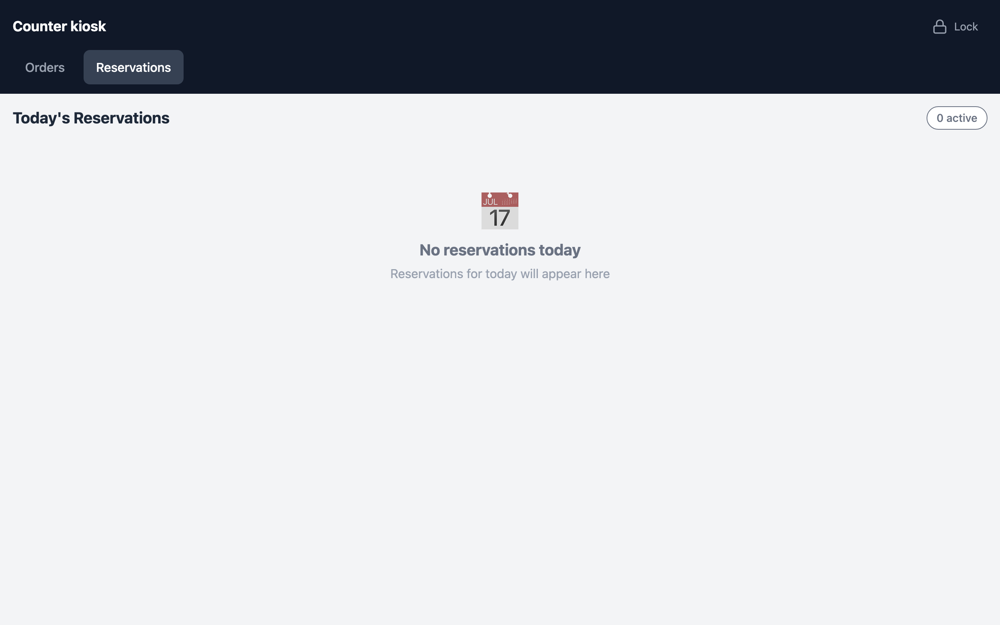

# Storefront Kiosk

A dedicated, full-screen order queue for front-of-house staff — typically on a
tablet at the counter. It's deliberately simple: see new orders, prepare them, mark
them ready.

---

## Pair the device with a PIN

The kiosk pairs to the restaurant with a one-time PIN generated in the admin
(Devices & Kiosks). No staff accounts to manage — the device itself is the login.



---

## The live order queue

Orders flow in and are organised by status — **New → Preparing → Ready** — with a
count badge per column. Each card shows the order number, time, customer phone,
items, and total, with one-tap actions to advance it.



> **Highlight:** the board auto-refreshes, so a new pickup order placed from a
> diner's phone appears here within seconds. Staff tap **Start Preparing**, then
> **Ready** — and the diner is texted at each step. No printer, no POS integration
> required to get started.

---

## Reservations view

If reservations are enabled, staff can see the day's bookings on the same device.



---

## How it fits together

```
Diner's phone  ──places order──▶  Backend  ──appears on──▶  Storefront kiosk
     ▲                                                            │
     └──────────────  texted status updates  ◀───── staff taps ──┘
```

One order, one source of truth, three surfaces — the diner, the owner's dashboard,
and the staff kiosk all stay in sync.
